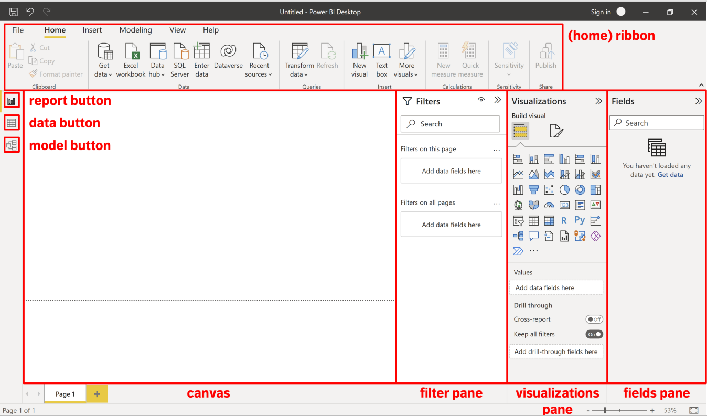
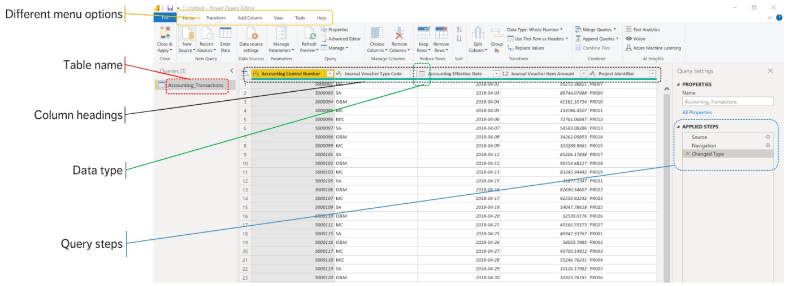
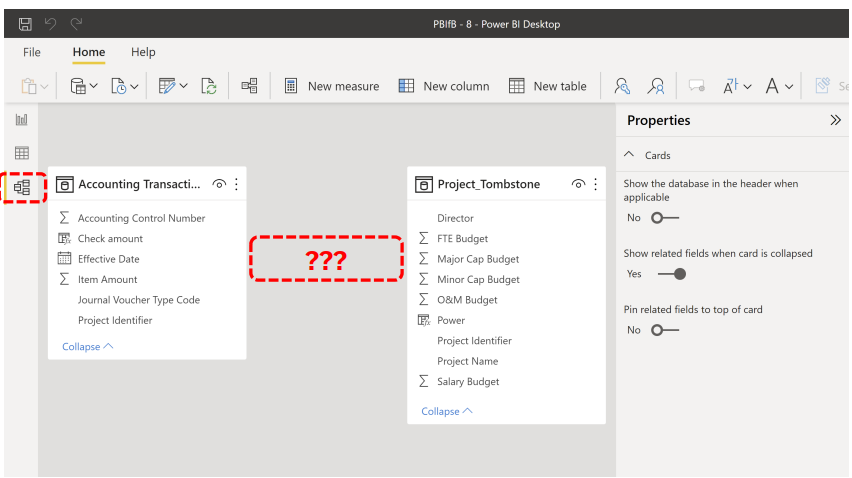
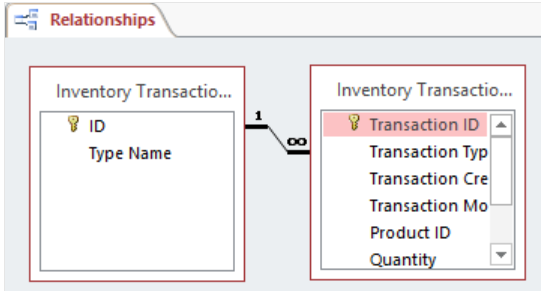
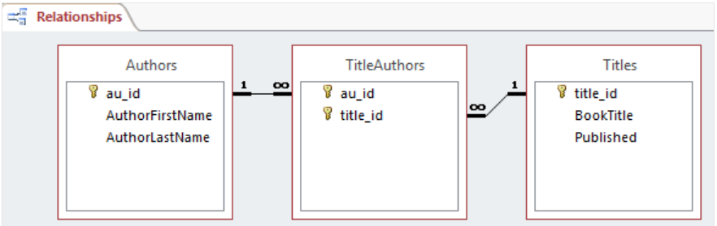
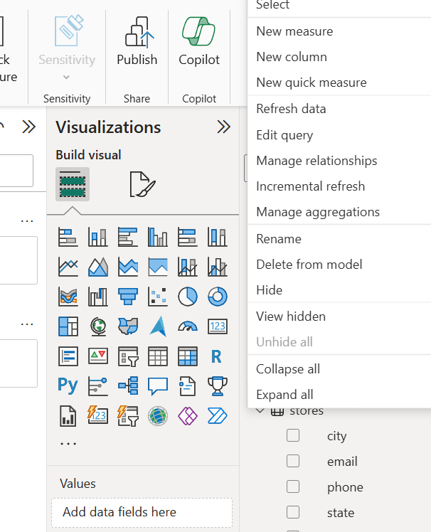

### Introducción a BI

#### Instalación


#### Generalidades



#### Transformar Datos



#### Data Model



---

#### Tablas relacionales

##### Relaciones entre tablas

<p>
En una base de datos relacional, las relaciones permiten evitar datos redundantes. Por ejemplo, si va a diseñar una base de datos que realiza un seguimiento de la información sobre libros, es posible que tenga una tabla denominada "Títulos" que almacene información sobre cada libro, como el título del libro, la fecha de publicación y el publicador. También hay información que puede almacenar sobre el editor, como el número de teléfono, la dirección y el código postal. Si almacena toda esta información en la tabla "Títulos", el número de teléfono del publicador se duplicaría para cada título que el editor imprime. <br>

Una mejor solución consiste en almacenar la información del publicador una sola vez, en una tabla independiente denominada "Publicadores". Después, colocaría un puntero en la tabla "Titles" que hace referencia a una entrada en la tabla "Publishers".
</p>

##### Tipos de relaciones de una tabla

<p>
Una relación funciona mediante la coincidencia de datos en columnas de clave, normalmente columnas (o campos) que tienen el mismo nombre en ambas tablas. En la mayoría de los casos, la relación conecta la clave principal o la columna de identificador único para cada fila, de una tabla a un campo de otra tabla. La columna de la otra tabla se conoce como "clave externa". Por ejemplo, si desea realizar un seguimiento de las ventas de cada título de libro, cree una relación entre la columna de clave principal (vamos a llamarla title_ID) en la tabla "Titles" y una columna de la tabla "Sales" denominada title_ID. La columna title_ID de la tabla "Sales" es la clave externa.
<br>
Podemos encontrar varios tipos de relaciones:
</p>

###### 1. Uno a muchos
<p>
Una relación uno a varios es el tipo de relación más común. En este tipo de relación, una fila de la tabla A puede tener muchas filas coincidentes en la tabla B. Pero una fila de la tabla B solo puede tener una fila coincidente en la tabla A. Por ejemplo, las tablas "Publishers" y "Titles" tienen una relación uno a varios. Es decir, cada publicador genera muchos títulos. Pero cada título procede de un solo publicador. </p>




###### 2. Uno a uno
<p>
En una relación uno a uno, una fila de la tabla A no puede tener más de una fila coincidente en la tabla B y viceversa. Se crea una relación uno a uno si ambas columnas relacionadas son claves principales o tienen restricciones únicas.

Este tipo de relación no es común, ya que la mayoría de la información relacionada de esta manera estaría en una tabla. Puede usar una relación uno a uno para realizar las siguientes acciones:

- Divida una tabla con muchas columnas.
- Aísle una parte de una tabla por motivos de seguridad.
- Almacene datos de corta duración y que se puedan eliminar fácilmente mediante la eliminación de la tabla.
- Almacenar información que solo se aplica a un subconjunto de la tabla principal.

</p>

###### 3. Muchos a muchos

<p>
En una relación de varios a varios, una fila de la tabla A puede tener muchas filas coincidentes en la tabla B y viceversa. Para crear esta relación, se define una tercera tabla denominada tabla de unión. La clave primaria de la tabla de unión consta de las claves foráneas de la tabla A y de la tabla B. Por ejemplo, la tabla "Authors" y la tabla "Titles" tienen una relación de muchos a muchos, que se define por una relación uno a muchos de cada una de estas tablas a la tabla "TitleAuthors". La clave principal de la tabla "TitleAuthors" es la combinación de la columna au_ID (la clave principal de la tabla "Authors") y la columna title_ID (la clave principal de la tabla "Titles").
</p>



---

#### Bike Store Relational Database

#### Crear una nueva medida



Creación nueva medida:

```bash
Total Sales = 
SUMX(
    'order_items',
    'order_items'[list_price] * 'order_items'[quantity]
)
```

---


---

#### Glosario:
<b>Entidad: </b>
<p>
Algo que se puede definir, como una persona, objeto, concepto u evento, que puede tener datos almacenados acerca de este. Piensa en las entidades como si fueran sustantivos. Por ejemplo: un cliente, estudiante, auto o producto. Por lo general se muestran como un rectángulo. </p>

<b>Cardinalidad:</b>
<p>Define los atributos numéricos de la relación entre dos entidades o conjuntos de entidades. Las tres relaciones cardinales principales son uno a uno, uno a muchos y muchos a muchos. Un ejemplo de uno a uno sería un estudiante asociado a una dirección de correo electrónico. Un ejemplo de uno a muchos (o muchos a uno, en función de la dirección de la relación) sería un estudiante que se inscribe en muchos cursos, y todos esos cursos se asocian a ese estudiante en particular. Un ejemplo de muchos a muchos sería los estudiantes en grupo están asociados a múltiples miembros de la facultad y a su vez los miembros de la facultad están asociados a múltiples estudiantes.
</p>

#### Referencias:
[1] Tablas relacionales: https://learn.microsoft.com/es-es/office/troubleshoot/access/define-table-relationships

[2] Base de datos: https://www.kaggle.com/datasets/dillonmyrick/bike-store-sample-database?resource=download

[3] Entidad relación:
https://www.lucidchart.com/pages/es/que-es-un-diagrama-entidad-relacion

[4] Esquemas de tablas (star or snowflake):
https://learn.microsoft.com/es-es/power-bi/guidance/star-schema