---
### 1. Install connector for Power BI

for the connector visit:

https://dev.mysql.com/downloads/connector/net/?os=src
 
 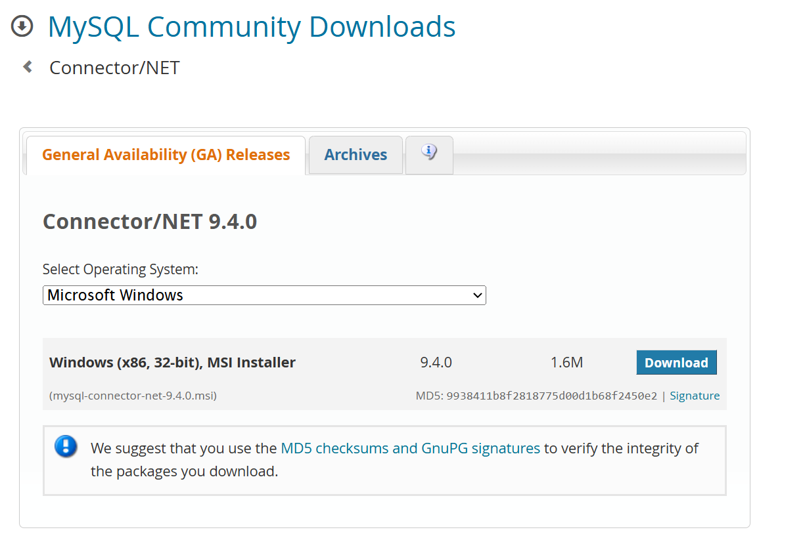

in the web site you will find the link to download the connector for your system.

You should chose this option to dont create a new account on oracle.

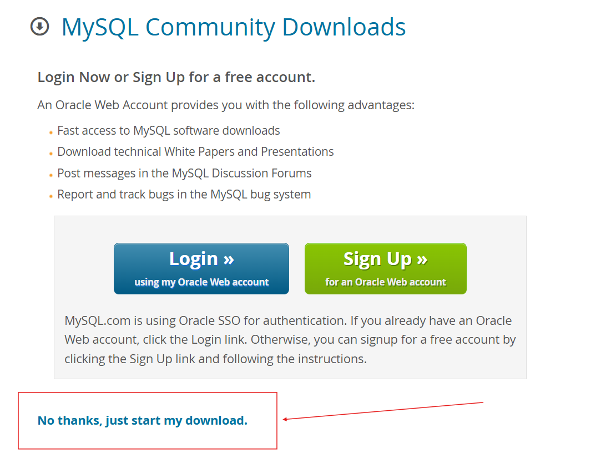

### 2. Install the connector for Power BI
Next
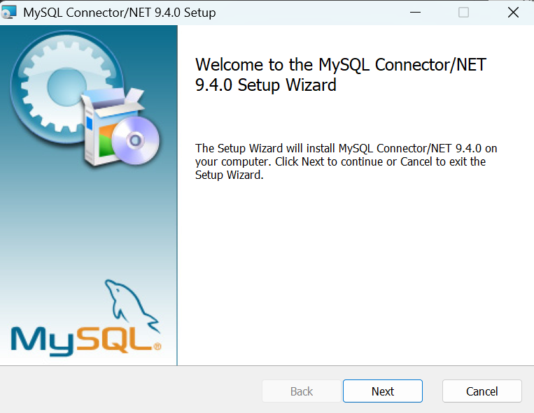

Next
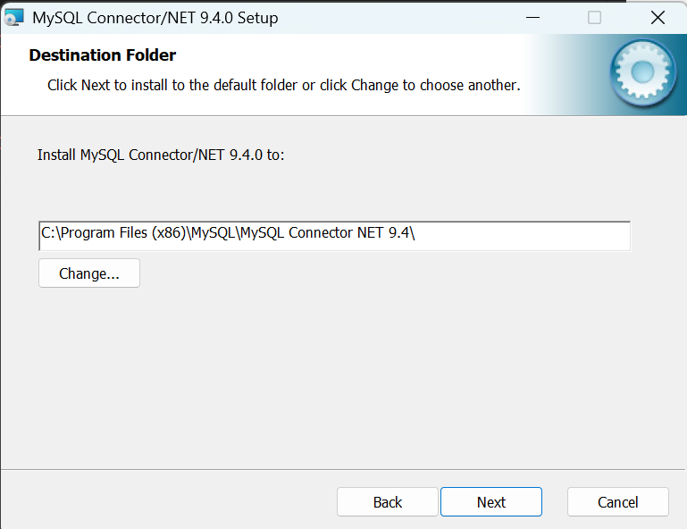

and install
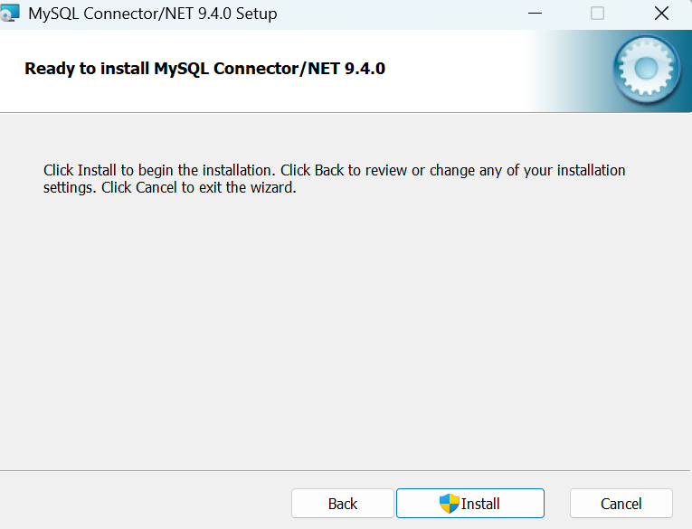

### 3. Test the connection
In power bi follow the next steps:

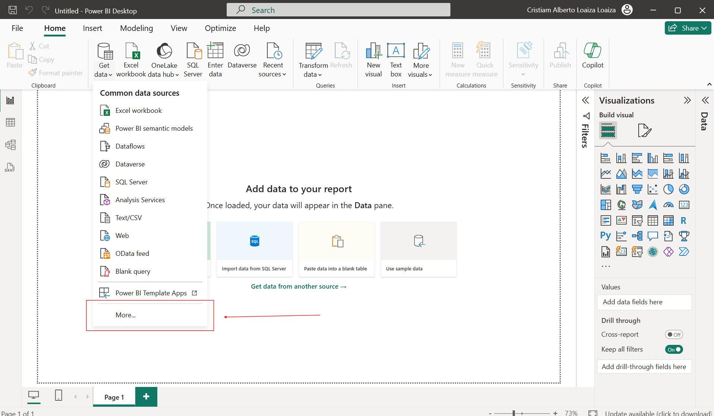

Select this option and click on connect

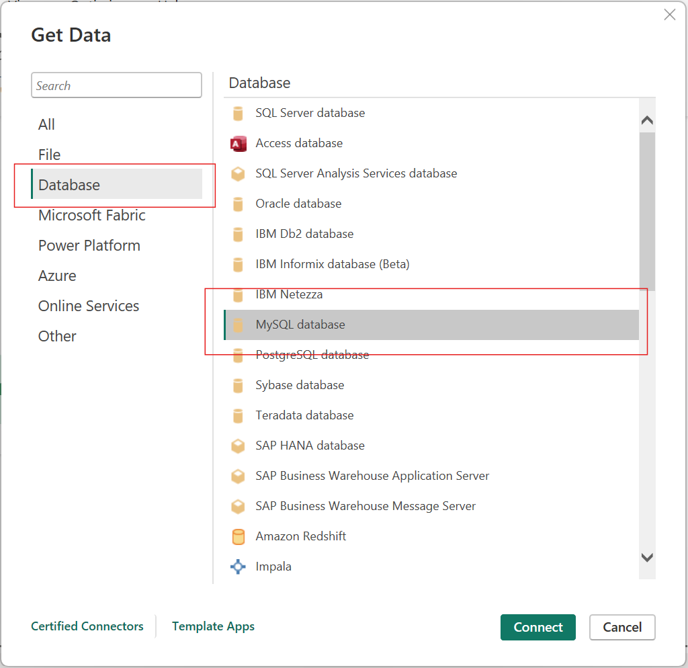

### 4. Link to install mysql
In the next step select the option to link to install mysql

https://dev.mysql.com/downloads/installer/

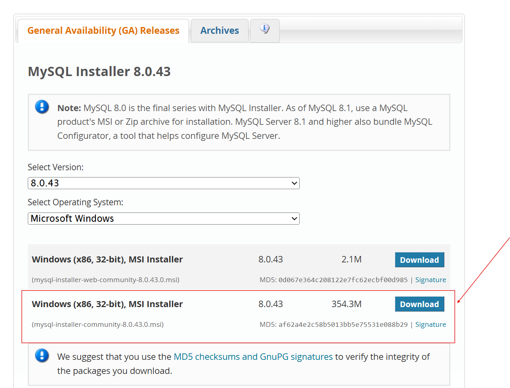

always chose the option to install mysql that contain workbench, shell and server its very important for the next steps.

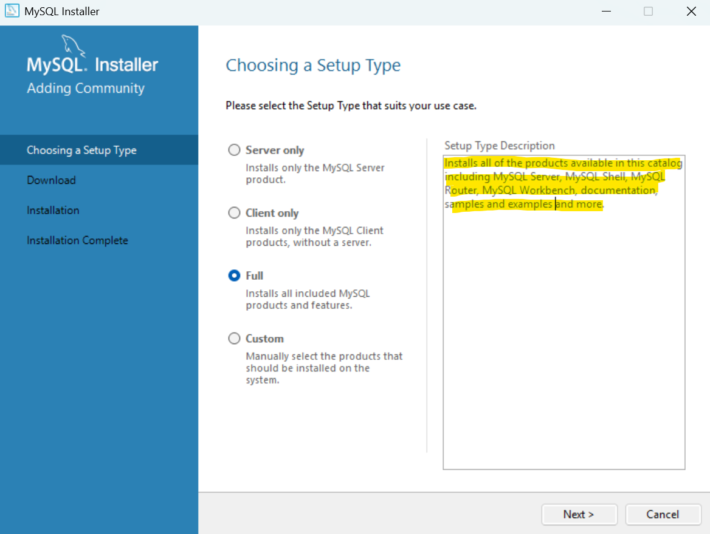

requirements to install mysql

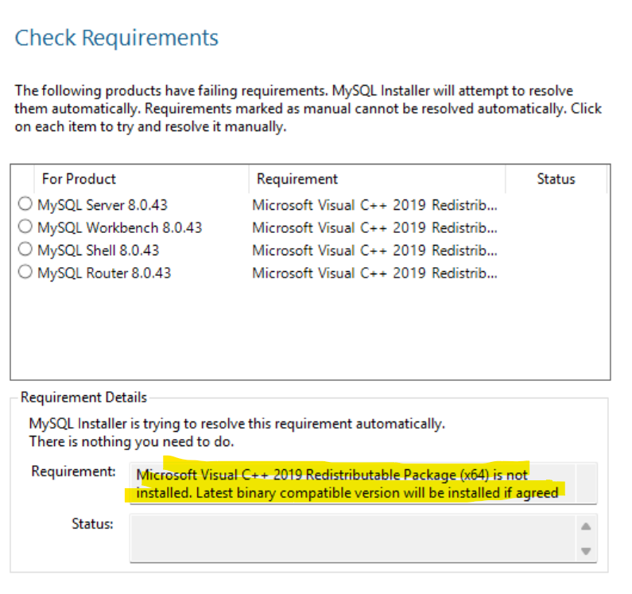

video reference to install mysql
https://www.youtube.com/watch?v=v8i2NgiM5pE

### 5. Create the database, tables and insert data.

### 6. Create the connection in power bi

the first step is to create a new connection in mysql
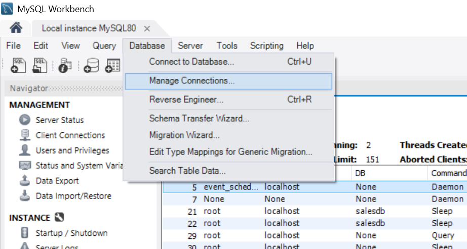

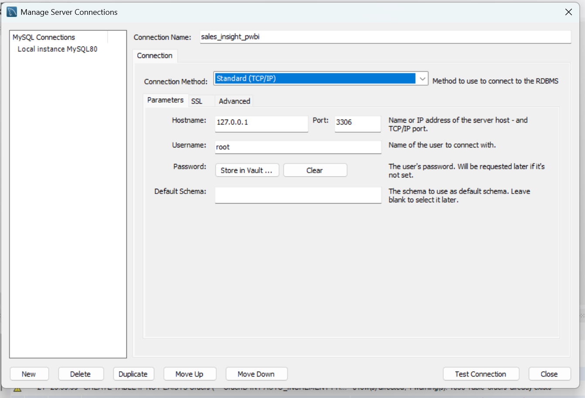

Then configure in power bi the connection with port and database name.
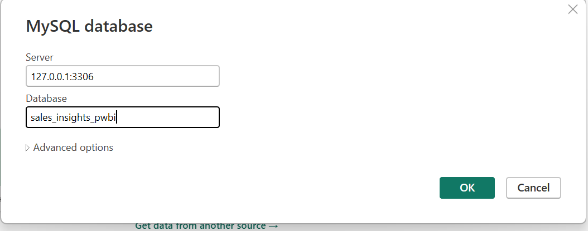

write here the database name and password

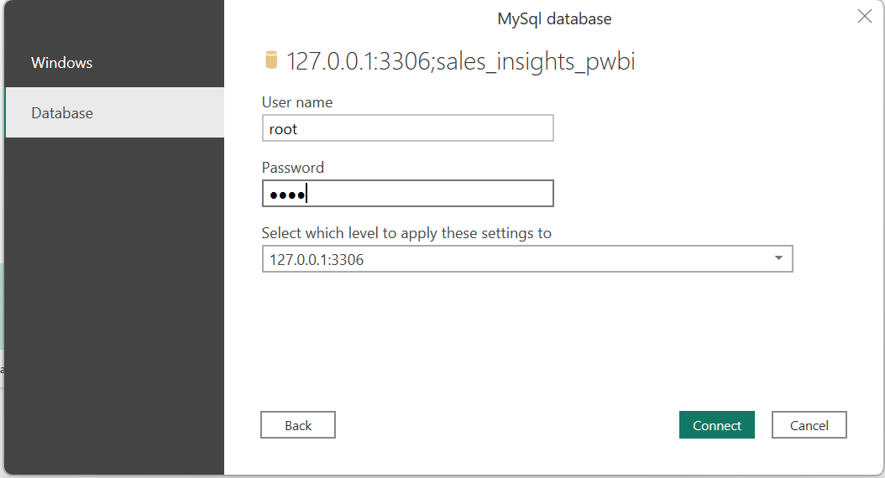

in power bi the connection is created and you can start to create the report.

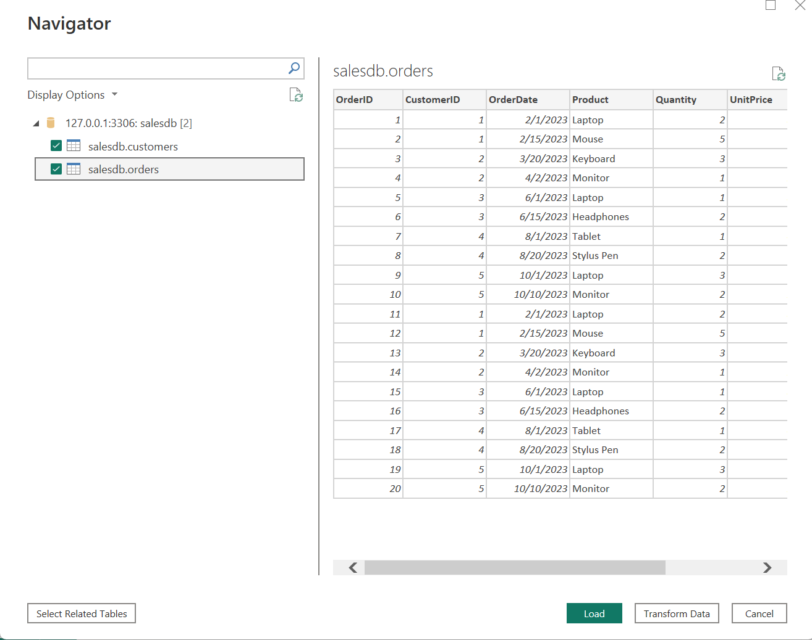

### 7. Create the report in power bi

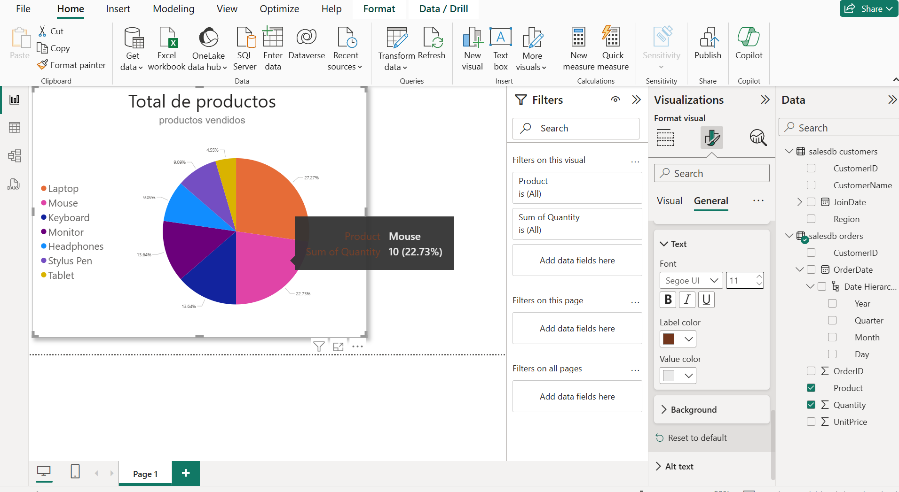

video reference to create the connection between mysql and power bi
https://www.youtube.com/watch?v=5KkAh6NKr7s

Author: Cristiam Loaiza
Date: 08/20/2025