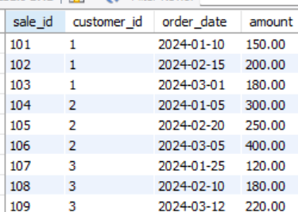
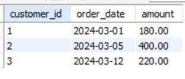
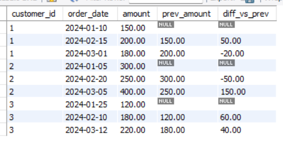
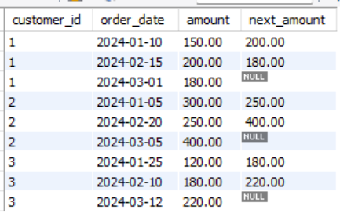

#### 1. Row Number
--

```sql
ROW_NUMBER()
```
<p>
we can use the ROW_NUMBER() function to assign a unique row number to each row within a partition, following a defined order. It's useful for finding duplicates, selecting the first occurrence of a record, or paginating results. </p>



<br>
<br>

```sql
--- to find the last purchase of each client
SELECT customer_id, order_date, amount
FROM (
    SELECT 
        customer_id,
        order_date,
        amount,
        ROW_NUMBER() OVER (PARTITION BY customer_id ORDER BY order_date DESC) AS rn
    FROM sales
) t
WHERE rn = 1;
```


After execute this query, we can see that the row number



--

#### 2. Lag and Lead
---
<p>
The lag and lead functions are used to access the value of a column in the previous or next row within a partition, respectively. They're useful for calculating differences, finding trends, or analyzing historical data. </p>

##### 2.1 Lag
--

<p>
The lag function returns the value of a column from the previous row within a partition. It's useful for finding the previous value of a column, or calculating differences. </p>


```sql
-- calculate the difference with the previous purchase

SELECT 
    customer_id,
    order_date,
    amount,
    LAG(amount, 1) OVER (PARTITION BY customer_id ORDER BY order_date) AS prev_amount,
    amount - LAG(amount, 1) OVER (PARTITION BY customer_id ORDER BY order_date) AS diff_vs_prev
FROM sales;
```




##### 2.2 Lead
--

<p>
The lead function returns the value of a column from the next row within a partition. It's useful for finding the next value of a column, or calculating trends. </p>


```sql
-- to find the next purchase of each customer

SELECT 
    customer_id,
    order_date,
    amount,
    LEAD(amount, 1) OVER (PARTITION BY customer_id ORDER BY order_date) AS next_amount
FROM sales;
```




---

#### 3. Ejercicios
--

#### 3.1 Ejercicio
Tienes la tabla sales con las columnas:

```
sale_id
customer_id
order_date
amount
```


- La empresa quiere analizar el comportamiento de compras de cada cliente.


- Obtener la primera y última compra de cada cliente.

- Calcular la diferencia de gasto entre compras consecutivas (LAG).

- Calcular la compra futura siguiente (LEAD).

- Identificar si la compra fue la primera, intermedia o última usando ROW_NUMBER.

```sql

-- enumerate the purchase
SELECT customer_id, 
	   order_date, 
       amount,
       ROW_NUMBER() OVER (PARTITION BY customer_id ORDER BY ORDER_DATE DESC) AS order_ 
FROM SALES AS T;

-- diference between spent
SELECT customer_id, order_date, amount,
	   ROW_NUMBER() OVER (PARTITION BY customer_id order by order_date) top,
	   LAG(amount,1) OVER ( partition by customer_id order by order_date ) as last_purchase,
       amount - LAG(amount,1) over ( partition by customer_id order by order_date) as diff,
       COUNT(*) OVER (PARTITION BY customer_id ) total_orders,
       CASE
			WHEN ROW_NUMBER() OVER (PARTITION BY customer_id order by order_date)  = 1 THEN "PRIMERA COMPRA"
            WHEN ROW_NUMBER() OVER (PARTITION BY customer_id order by order_date)  = COUNT(*) OVER (PARTITION BY customer_id) THEN 'Última compra'
            ELSE "COMPRA INTERMEDIA"
	   END AS compra_tipo
FROM SALES

```

#### 3.2 Ejercicio
--

La empresa quiere medir qué tan seguido compran los clientes.
Se necesita construir un reporte que muestre:

- La diferencia en días entre una compra y la compra anterior (DATEDIFF + LAG).

- El promedio de días entre compras de cada cliente.

- Detectar si el cliente es "Activo" o "Inactivo":

  - Activo → si la diferencia entre la última compra y la anterior es ≤ 30 días.
  - Inactivo → si es mayor a 30 días.

---

#### 3.3 Ejercicio
--

La empresa quiere saber quiénes son los clientes que más gastan cada mes.
Necesitas construir un reporte que muestre:

- El gasto mensual total por cliente.

- El ranking de clientes dentro de cada mes según el gasto.

- Filtrar solo el Top 3 clientes por mes.

- Mostrar también el gasto acumulado del cliente en el año.