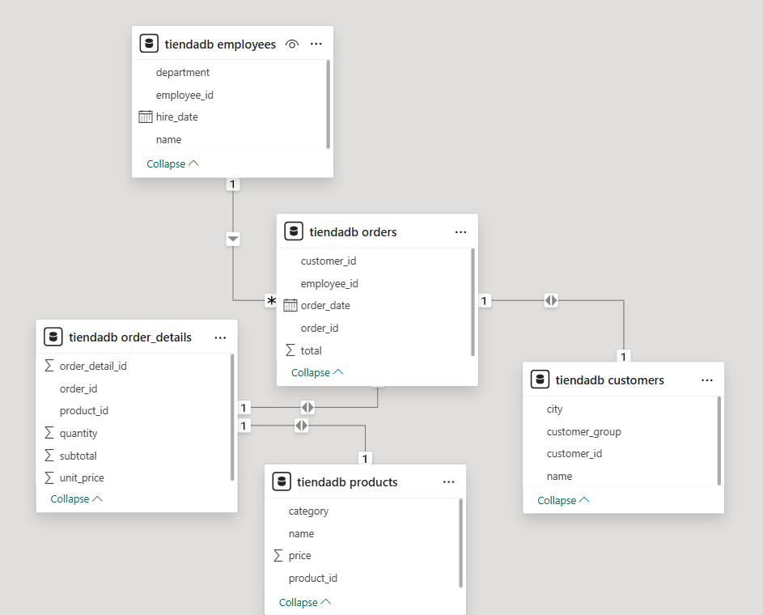

## Tutorial SQL Avanzado
---
### Optimización de consultas

La optimización de consultas SQL es el proceso de mejorar la eficiencia y el rendimiento de las sentencias SQL para que se ejecuten más rápido, reduciendo el tiempo y los recursos de la base de datos. Las técnicas clave incluyen el uso estratégico de índices para acelerar las búsquedas, la selección cuidadosa de los tipos de JOIN y la optimización de las cláusulas WHERE para filtrar datos de forma eficiente. Analizar los planes de ejecución de las consultas y evitar la recuperación de datos innecesarios (como SELECT *) también son fundamentales para un buen rendimiento.

### 15 técnicas para mejorar el rendimiento

### 1. Utiliza una indexación adecuada  

Imagina que buscamos un libro en una biblioteca sin catálogo. Tendríamos que revisar cada estante y cada fila hasta que por fin lo encontráramos.  
Los índices de una base de datos son similares a los catálogos: **nos ayudan a localizar rápidamente los datos que necesitamos sin necesidad de escanear toda la tabla**.


#### ¿Cómo funcionan los índices?

Los índices son **estructuras de datos** que mejoran la velocidad de recuperación de los datos.  
Funcionan creando una **copia ordenada de las columnas indexadas**, lo que permite a la base de datos localizar rápidamente las filas que coinciden con nuestra consulta, ahorrándonos mucho tiempo.

## Tipos de índices en bases de datos

Existen varios tipos de índices que pueden mejorar el rendimiento de las consultas dependiendo del caso de uso:

- **Índices agrupados**  
  Ordenan físicamente los datos en función de los valores de las columnas y se utilizan mejor para datos secuenciales u ordenados sin duplicados, como las claves primarias.

- **Índices no agrupados**  
  Crean dos columnas separadas, lo que los hace adecuados para tablas de asignación o glosarios. 

- **Índices de texto completo**  
  Se utilizan para buscar en grandes campos de texto, como artículos o correos electrónicos, almacenando las posiciones de los términos dentro del texto.

- **Índices de columnas consultadas con frecuencia**  
  Si solemos buscar en una tabla utilizando `customer_id` o `item_id`, indexar esas columnas tendrá un gran impacto en la velocidad.  

  Ejemplo en SQL:  
  ```sql
  CREATE INDEX index_customer_id ON customers (customer_id);
  ```
- Buenas prácticas con índices

- **Evita utilizar índices innecesarios**
Aunque los índices son muy útiles para acelerar las consultas en SELECT, pueden ralentizar ligeramente las operaciones en INSERT, UPDATE y DELETE.
Esto se debe a que el índice debe actualizarse cada vez que modificas datos.
→ Demasiados índices pueden aumentar la sobrecarga de las modificaciones.

- **Elige el tipo de índice adecuado**
Las distintas bases de datos ofrecen varios tipos de índices.
Debemos elegir el que mejor se adapte a nuestros datos y patrones de consulta.
Por ejemplo:
Un índice de árbol B (B-Tree) es una buena elección si buscamos a menudo rangos de valores.


2.	**Evita seleccionar** 
A veces, tenemos la tentación de utilizar SELECT * para coger todas las columnas, incluso las que no son relevantes para nuestro análisis. Aunque esto pueda parecer cómodo, da lugar a consultas muy ineficaces que pueden ralentizar el rendimiento. 

La base de datos tiene que leer y transferir más datos de los necesarios, lo que requiere un mayor uso de memoria, ya que el servidor debe procesar y almacenar más información de la necesaria.

Como buena práctica general, sólo debemos seleccionar las columnas específicas que necesitemos. Minimizar los datos innecesarios no sólo mantendrá nuestro código limpio y fácil de entender, sino que también ayudará a optimizar el rendimiento:

Forma incorrecta:

```sql
SELECT * 
FROM products;

```

Forma correcta:

```sql
SELECT product_id, product_name, price 
FROM products;
```

### 3. Evita la Recuperación de Datos Redundantes o Innecesarios

Acabamos de comentar que seleccionar sólo las columnas relevantes se considera una buena práctica para optimizar las consultas SQL. Sin embargo, también es importante limitar el número de filas que estamos recuperando, no sólo de columnas. Las consultas suelen ralentizarse cuando aumenta el número de filas. 

Podemos utilizar LIMIT para reducir el número de filas devueltas. Esta función evita que recuperemos involuntariamente miles de filas de datos cuando sólo necesitamos trabajar con unas pocas. 

La función LIMIT es especialmente útil para consultas de validación o para inspeccionar la salida de una transformación en la que estemos trabajando. Es ideal para experimentar y comprender cómo se comporta nuestro código. Sin embargo, puede no ser adecuado para modelos de datos automatizados, en los que necesitamos devolver todo el conjunto de datos.

```sql
SELECT name
FROM customers
ORDER BY customer_group DESC
LIMIT 100;
```

### 4. Optimizar las cláusulas WHERE

La cláusula WHERE es esencial en las consultas SQL porque nos permite filtrar los datos basándonos en condiciones específicas, asegurándonos de que sólo se devuelven los registros relevantes. Mejora la eficacia de la consulta reduciendo la cantidad de datos procesados, lo que es muy importante para trabajar con un gran conjunto de datos. 

Por tanto, una cláusula WHERE correcta puede ser un poderoso aliado cuando optimizamos el rendimiento de una consulta SQL. Veamos algunas formas de aprovechar esta cláusula:

- Añade condiciones de filtrado adecuadas desde el principio. A veces, tener una cláusula WHERE es bueno, pero no suficiente. Debemos tener cuidado con dónde colocamos la cláusula. Filtrar tantas filas como sea posible al principio de la cláusula WHERE puede ayudarnos a optimizar la consulta.

- Evita utilizar funciones sobre columnas en la cláusula WHERE. Cuando aplicamos una función a una columna, la base de datos tiene que aplicar esa función a todas las filas de la tabla antes de poder filtrar los resultados. Esto impide que la base de datos utilice los índices con eficacia.

**Consulta como se realiza normalmente:**

```sql
SELECT * 
FROM employees 
WHERE YEAR(hire_date) = 2020;
```

Consulta sugerida:

```sql
SELECT *
FROM employees
WHERE hire_date >= '2020-01-01' AND hire_date < '2021-01-01';
```


•	Utiliza operadores adecuados. Debemos elegir los operadores más eficientes que satisfagan nuestras necesidades. Por ejemplo, = suele ser más rápido que LIKE, y utilizar intervalos de fechas específicos es más rápido que utilizar funciones como MONTH(order_date).
Ejemplo:
En lugar de esto:


En lugar de esto:
```sql
SELECT *
FROM orders
WHERE MONTH(order_date) = 12 AND YEAR(order_date) = 2023;
```

Podemos hacer esto:
```sql
SELECT *
FROM orders
WHERE order_date >= '2023-12-01' AND order_date < '2024-01-01';
```

5. **Optimizar subconsultas**
En algunos casos, estamos escribiendo una consulta y sentimos que necesitamos realizar dinámicamente algún filtrado, agregación o unión de datos. No queremos hacer varias consultas, sino limitarnos a una sola.  
Para esos casos, podemos utilizar subconsultas. Las subconsultas en SQL son consultas anidadas dentro de otra consulta, normalmente en las sentencias SELECT, INSERT, UPDATE, o DELETE.  
Las subconsultas pueden ser potentes y rápidas, pero también pueden causar problemas de rendimiento si no se utilizan con cuidado. Por regla general, debemos minimizar el uso de subconsultas y seguir una serie de buenas prácticas. 

- Sustituye las subconsultas por uniones cuando sea posible. Las uniones suelen ser más rápidas y eficaces que las subconsultas.  
- Utiliza en su lugar expresiones comunes de tabla (CTE).  Las CTE separan nuestro código en varias consultas más pequeñas en lugar de una sola grande, lo que resulta mucho más fácil de leer.  

---

6. **Limitar el uso de DISTINCT**
Imagina que estamos trabajando en un análisis para enviar una oferta promocional a clientes de ciudades únicas. La base de datos tiene varios pedidos de los mismos clientes. Lo primero que se nos ocurre es utilizar la cláusula DISTINCT.  
Esta función es útil para determinados casos, pero puede consumir muchos recursos, especialmente en conjuntos de datos grandes. Hay algunas alternativas a DISTINCT:  

- Identifica y elimina los datos duplicados durante los procesos de limpieza de datos. Esto evita que los duplicados se cuelen en nuestra base de datos en primer lugar.  
- Utiliza GROUP BY en lugar de DISTINCT siempre que sea posible. GROUP BY puede ser más eficaz, sobre todo si se combina con funciones agregadas.  

**Ejemplo:**  

En lugar de esto:  

```sql
SELECT DISTINCT city FROM customers;
```

Podemos hacer esto:
```sql
SELECT city FROM customers GROUP BY city;
```


---

### Ejercicios propuestos:



#### Ejercicios con where
1. Clientes de una ciudad específica
2. Productos de una categoría con precio mayor a cierto valor
3. Empleados contratados después de cierta fecha
4. Órdenes de un rango de fechas
5. Clientes corporativos de ciudades específicas

#### Subconsultas
6. Clientes que han realizado órdenes superiores a $1500
7. Productos que nunca han sido vendidos
8. Empleados que han atendido órdenes de clientes corporativos
9. Órdenes con montos superiores al promedio
10. Productos más caros que el promedio de su categoría
11. Clientes que han gastado más del promedio

#### Ejercicios con DISTICT
12. Ciudades únicas donde hay clientes
13. Categorías de productos disponibles
14. Grupos de clientes distintos
15. Departamentos de empleados únicos
16. Fechas distintas en que se han realizado órdenes

#### Ejercicios COMBINADOS (WHERE + SUBCONSULTAS + DISTINCT)

17. Ciudades que tienen clientes corporativos

18. Productos de tecnología vendidos en órdenes superiores a $1000

19. Empleados que han atendido órdenes de más de un cliente

20. Cliente que han comprado productos de más de una categoría

21. Productos vendidos en órdenes realizadas por empleados de ventas

Referencia:

creaciones_db/tiendadb-cracion-db.sql

