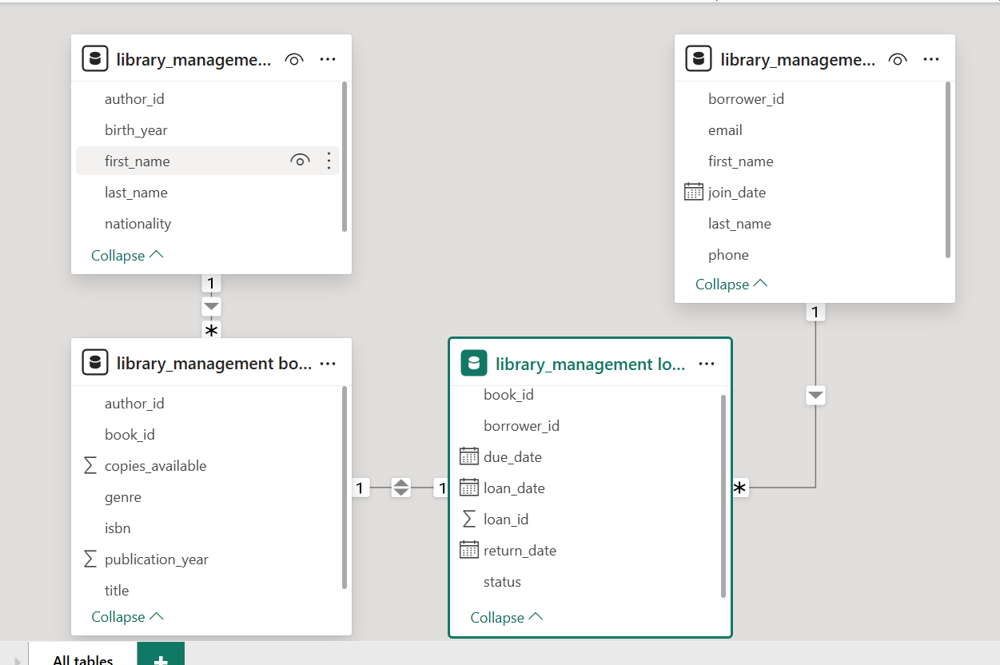

### Tabla de hechos

tabla de hechos es una tabla que almacena datos cuantitativos o métricas (hechos) que suelen ser el foco de análisis, como ventas, transacciones o eventos. Estas tablas generalmente contienen valores numéricos (medidas) y claves foráneas que se relacionan con tablas de dimensiones, las cuales proporcionan el contexto (como fechas, clientes o productos) 

### Identificación de la tabla de hechos

Tabla loans:

Propósito: Registra los eventos de préstamo de libros, que son las transacciones principales en un sistema de gestión de bibliotecas.
Contenido:

- loan_id: Identificador único de cada préstamo.
- book_id: Clave foránea que se relaciona con la tabla books (dimensión).
- borrower_id: Clave foránea que se relaciona con la tabla borrowers (dimensión).
- loan_date, return_date, due_date: Fechas que proporcionan contexto temporal (podrían relacionarse con una tabla de dimensión de tiempo si existiera).
- status: Estado del préstamo (borrowed, returned, overdue), que puede usarse para análisis categóricos.

#### Por qué loans es la tabla de hechos

- Registra eventos: Cada fila en loans representa una transacción (un préstamo), que es el evento central del sistema.
- Claves foráneas: Se relaciona con las tablas de dimensiones (books, borrowers), lo que permite análisis multidimensionales (e.g., "¿Cuántos libros de un género específico se prestaron en 2025?").
- Análisis: Es la tabla donde se centrarían las consultas analíticas, como conteo de préstamos, libros más populares, o usuarios más activos.

---

### CTEs

Una CTE es útil cuando queremos descomponer una consulta compleja en partes más manejables, reutilizar resultados intermedios, o realizar cálculos en pasos.

